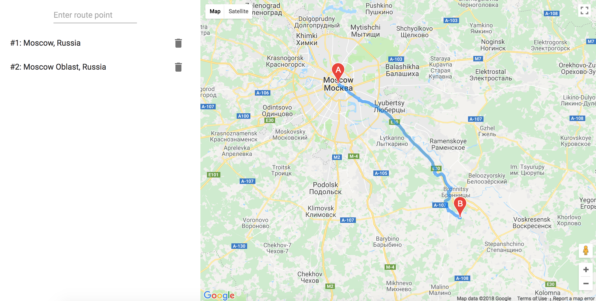

# ! WORK IN PROGRESS !



## route-editor

> route-editor — a single-page application in which a user interactively creates a route on a map by specifying start, end, and intermediate points of travel. For each point of the route you can see its address.

## Installing / Getting started

```shell
npm install
npm start
```
or
```shell
yarn
yarn start
```


## TODO

- add drag and drop
- add info window on marker click

## Links

This project was bootstrapped with [Create React App](https://github.com/facebookincubator/create-react-app).
